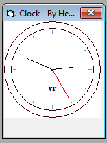

# Analogue Clock (VB6)

By Hevanafa (Aug 2023)

A basic standard 12-hour analogue clock display.  The weekday changes depending on your system's regional setting.

The resolution is 100 ms.  This project should be compatible with VB6 Portable or the standard Microsoft Visual Basic 6.0 installation.
